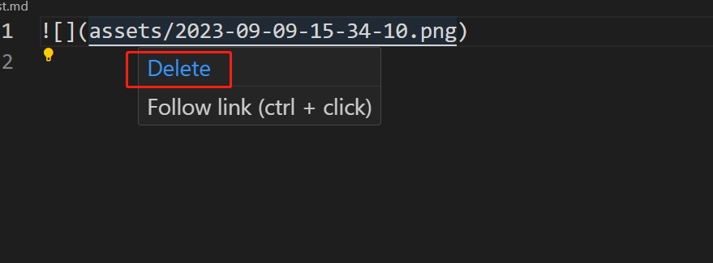
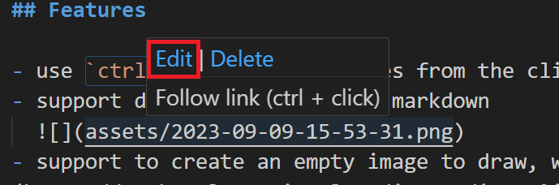
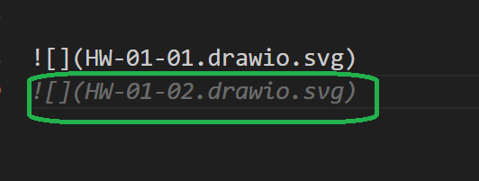
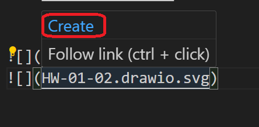
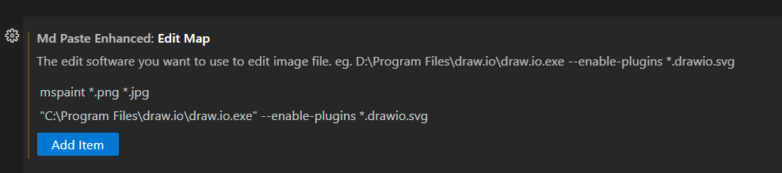

# paste enhanced

- market: https://marketplace.visualstudio.com/items?itemName=dzylikecode.md-paste-enhanced
- online docs: https://dzylikecode.github.io/Inspire-VSCodeExt-Paste-Image/#/

It works the same as [Paste Image](https://marketplace.visualstudio.com/items?itemName=mushan.vscode-paste-image) does. What I focus on is to make it work well on WSL and Windows and to use `ctrl + v` to paste images instead of `ctrl + alt + v`.

paste anywhere if you want.

## Features

- use `ctrl + v` to paste images from the clipboard when writing markdown.
- support delete image file in markdown
  
- support to create an empty image to draw, which is very useful for the extension [Draw.io Integration](https://marketplace.visualstudio.com/items?itemName=hediet.vscode-drawio) and [Excalidraw - Visual Studio Marketplace](https://marketplace.visualstudio.com/items?itemName=pomdtr.excalidraw-editor)
- support edit image with specific App
  
- sometimes Github Copilot will suggest a good image name, so it's very nice to support to create an image read from clipboard (or an empty image if no image contained in clipboard) with the name suggested by Github Copilot
  
  
- support typst
- support defining render pattern according to the file type ([minimatch](http://adilapapaya.com/docs/minimatch/#usage))

## Extension Settings

- `mdPasteEnhanced.path`:string

  The destination to save image file.

  - `default`: `${currentFileDir}/assets`

  You can use variable:

  - `${currentFileDir}`: the path of directory that contain current editing file.
  - `${projectRoot}`: the path of the project opened in vscode.
  - `${currentFileName}`: the name of current editing file.
  - `${currentFileNameWithoutExt}`: the name of current editing file without extension.

  > example: `${currentFileDir}/${currentFileNameWithoutExt}`

- `mdPasteEnhanced.basePath`:string

  The base path of image url.

  - `default`: `${currentFileDir}`

  You can use variable:

  - `${currentFileDir}`: the path of directory that contain current editing file.
  - `${projectRoot}`: the path of the project opened in vscode.
  - `${currentFileName}`: the name of current editing file.
  - `${currentFileNameWithoutExt}`: the name of current editing file without extension.

- `mdPasteEnhanced.renderPattern`:string

  The pattern of image url.

  - `default`: ``

  You can use variable:

  - `${imagePath}`: the path of image file.

- `mdPasteEnhanced.confirmPattern`: enum

  which pattern to be confirmed when paste image

  - `default`: `None`

  - `None`

    won't show confirm dialog

  - `Just Name`

    show dialog with image name to be confirmed

  - `Full Path`

    show dialog with image full path to be confirmed

- `mdPasteEnhanced.createFileExt`: string

  the extension of image file to be created

  - `default`: `.excalidraw.svg`

- `mdPasteEnhanced.editMap`: string[]

  the map of image file to be edited

  - `default`: `[ "mspaint *.png *.jpg *.jpeg *.bmp" ]`

  

## Known Issues

> The plugin [`Markdown All in One`](https://github.com/yzhang-gh/vscode-markdown) will block the function that you paste image when selecting text. It's better to remove the condition that triggers paste `ctrl+v` in the shortcut settings of [`Markdown All in One`](https://github.com/yzhang-gh/vscode-markdown). Don't worry, this plugin will call the paste function of [`Markdown All in One`](https://github.com/yzhang-gh/vscode-markdown). I just think it's a bit of a hassle, why they can't work together without realizing the exsistence of each other.

## debug

1. git clone the project
  
   ```bash
   git clone https://github.com/dzylikecode/Inspire-VSCodeExt-Paste-Image.git
   ```

2. install npm dependencies

   ```bash
   cd Inspire-VSCodeExt-Paste-Image
   npm install
   ```

3. open the project in vscode and press `F5` to debug


4. publish the extension

   ```bash
   npm run build
   ```

## more feature

If you want more feature, for example, make it work on Mac and Linux, Please open an issue or pull request. 😏 😏 😏

**Enjoy!** 😊 😊 😊

## References

- [Commands | Visual Studio Code Extension API](https://code.visualstudio.com/api/extension-guides/command)
- [vscode-extension-samples/decorator-sample/USAGE.md at main · microsoft/vscode-extension-samples](https://github.com/microsoft/vscode-extension-samples/blob/main/decorator-sample/USAGE.md)
- [kisstkondoros/gutter-preview](https://github.com/kisstkondoros/gutter-preview)
- [Start-Process (Microsoft.PowerShell.Management) - PowerShell | Microsoft Learn](https://learn.microsoft.com/en-us/powershell/module/microsoft.powershell.management/start-process?view=powershell-7.3) ： 走远了, 没注意 ShellExecute 有重载
