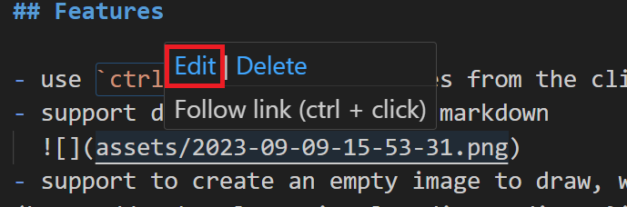

# md-paste-enhanced

- market: https://marketplace.visualstudio.com/items?itemName=dzylikecode.md-paste-enhanced
- online docs: https://dzylikecode.github.io/Inspire-VSCodeExt-Paste-Image/#/

Who can help me write the docs? 😭 😭 😭

It works the same as [Paste Image](https://marketplace.visualstudio.com/items?itemName=mushan.vscode-paste-image) does. What I focus on is to make it work well on WSL and Windows and to use `ctrl + v` to paste images instead of `ctrl + alt + v`.

## Features

- use `ctrl + v` to paste images from the clipboard when writing markdown.
- support delete image file in markdown
  
- support to create an empty image to draw, which is very useful for the extension [Draw.io Integration](https://marketplace.visualstudio.com/items?itemName=hediet.vscode-drawio) and [Excalidraw - Visual Studio Marketplace](https://marketplace.visualstudio.com/items?itemName=pomdtr.excalidraw-editor)
- support edit image with specific App
  
- sometimes Github Copilot will suggest a good image name, so it's very nice to support to create an image read from clipboard (or an empty image if no image contained in clipboard) with the name suggested by Github Copilot
  
  

## Extension Settings

- `mdPasteEnhanced.path`:string

  The destination to save image file.

  - `default`: `${currentFileDir}/assets`

  You can use variable:

  - `${currentFileDir}`: the path of directory that contain current editing file.
  - `${projectRoot}`: the path of the project opened in vscode.
  - `${currentFileName}`: the name of current editing file.
  - `${currentFileNameWithoutExt}`: the name of current editing file without extension.

  > example: `${currentFileDir}/${currentFileNameWithoutExt}`

- `mdPasteEnhanced.basePath`:string

  The base path of image url.

  - `default`: `${currentFileDir}`

  You can use variable:

  - `${currentFileDir}`: the path of directory that contain current editing file.
  - `${projectRoot}`: the path of the project opened in vscode.
  - `${currentFileName}`: the name of current editing file.
  - `${currentFileNameWithoutExt}`: the name of current editing file without extension.

- `mdPasteEnhanced.renderPattern`:string

  The pattern of image url.

  - `default`: ``

  You can use variable:

  - `${imagePath}`: the path of image file.

- `mdPasteEnhanced.compressEnable`:boolean

  Whether to compress the image.

  - `default`: false

- `mdPasteEnhanced.compressThreshold`:number

  Unit: KB

  the value which is used to determine whether the image need to be compressed.

  - `default`: 80

- `mdPasteEnhanced.confirmPattern`: enum

  which pattern to be confirmed when paste image

  - `default`: `None`

  - `None`

    won't show confirm dialog

  - `Just Name`

    show dialog with image name to be confirmed

  - `Full Path`

    show dialog with image full path to be confirmed

- `mdPasteEnhanced.createFileExt`: string

  the extension of image file to be created

  - `default`: `.excalidraw.svg`

- `mdPasteEnhanced.editMap`: string[]

  the map of image file to be edited

  - `default`: `[ "mspaint *.png *.jpg *.jpeg *.bmp" ]`

  

## Known Issues

> The plugin [`Markdown All in One`](https://github.com/yzhang-gh/vscode-markdown) will block the function that you paste image when selecting text. It's better to remove the condition that triggers paste `ctrl+v` in the shortcut settings of [`Markdown All in One`](https://github.com/yzhang-gh/vscode-markdown). Don't worry, this plugin will call the paste function of [`Markdown All in One`](https://github.com/yzhang-gh/vscode-markdown). I just think it's a bit of a hassle, why they can't work together without realizing the exsistence of each other.

## Release Notes

### 2.10.1

fix: the path includes space

### 2.10.0

support edit svg with specific App

### 2.9.0

support create an empty image

### 2.8.0

support delete image file in markdown

### 2.7.0

- https://github.com/dzylikecode/Inspire-VSCodeExt-Paste-Image/issues/21
- remove the compress feature

### 2.6.0

see: https://github.com/dzylikecode/Inspire-VSCodeExt-Paste-Image/issues/18

### 2.5.0

see https://github.com/dzylikecode/Inspire-VSCodeExt-Paste-Image/issues/14 and https://github.com/dzylikecode/Inspire-VSCodeExt-Paste-Image/pull/15

### 2.4.0

- feature: custom render pattern

### 2.3.0

compress image successfully

### 2.2.0

now, it can work

fix: can't work because of import third lib failed

> it drives me crazy again 😭 😭 😭

### 2.1.0

fix: can't work because of bundling the extension

> not work

### 2.0.0

feature:

- support different image type:

  - .png
  - .jpg

- support to set the threshold which is used to determine whether the image need to be compressed.

> not work

### 1.0.0

fix: errors in license and something wrong with project path

### 0.3.0

fix bug: wrong path in WSL

> bugs drive me crazy 😭 😭 😭

### 0.2.0

fix bug: wrong path of powershell script

### 0.1.0

compress the size of extension from 1 MB to 35.89KB

> can't work because of wrong path of powershell script

### 0.0.5

fix: PowerShell Script is not digitally signed

### 0.0.4

fix: error link in README.md

### 0.0.3

fix: Paste link without selection will trigger the paste function of `Markdown All in One`

### 0.0.2

remove annoying notification and docs in extensions

### 0.0.1

Initial release

---

## more feature

If you want more feature, for example, make it work on Mac and Linux, Please open an issue or pull request. 😏 😏 😏

**Enjoy!** 😊 😊 😊

## References

- [Commands | Visual Studio Code Extension API](https://code.visualstudio.com/api/extension-guides/command)
- [vscode-extension-samples/decorator-sample/USAGE.md at main · microsoft/vscode-extension-samples](https://github.com/microsoft/vscode-extension-samples/blob/main/decorator-sample/USAGE.md)
- [kisstkondoros/gutter-preview](https://github.com/kisstkondoros/gutter-preview)
- [Start-Process (Microsoft.PowerShell.Management) - PowerShell | Microsoft Learn](https://learn.microsoft.com/en-us/powershell/module/microsoft.powershell.management/start-process?view=powershell-7.3) ： 走远了, 没注意 ShellExecute 有重载
